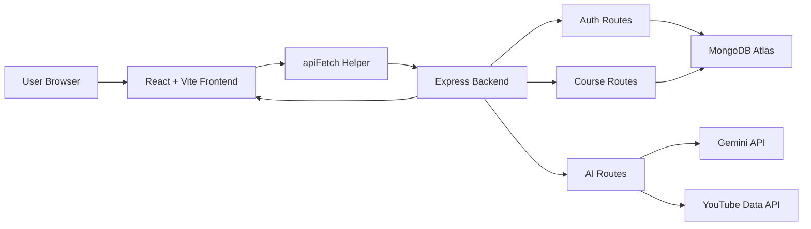
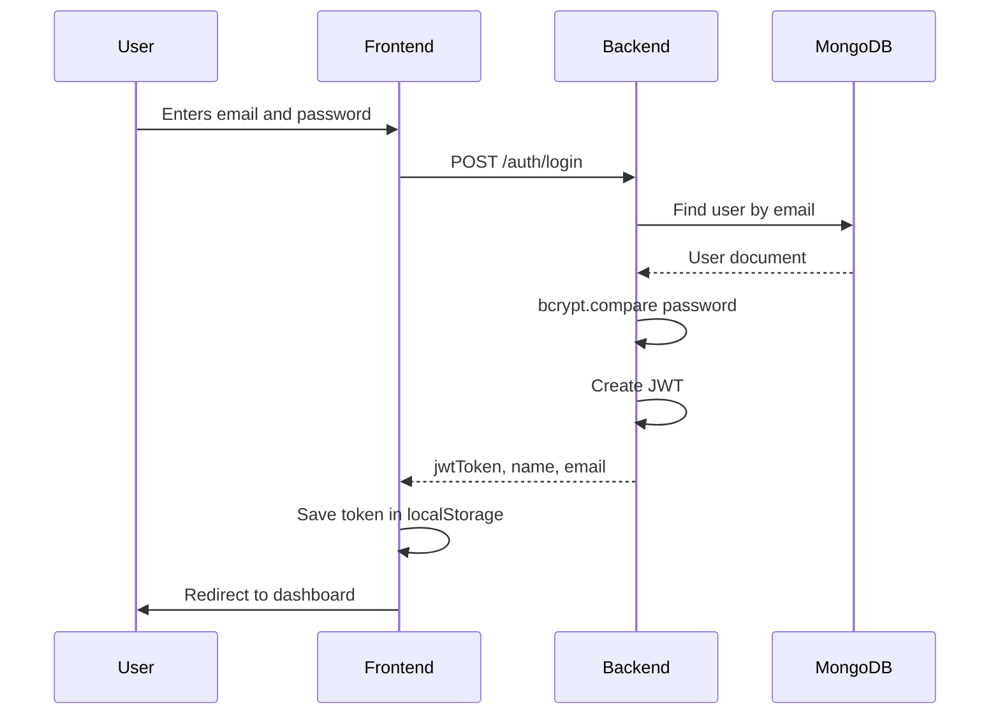
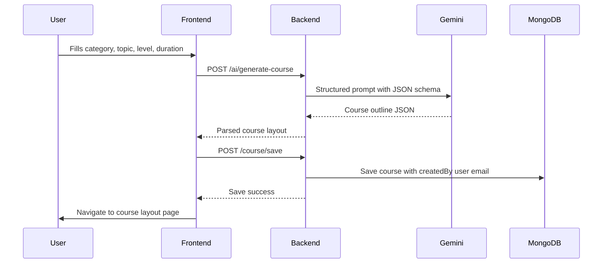
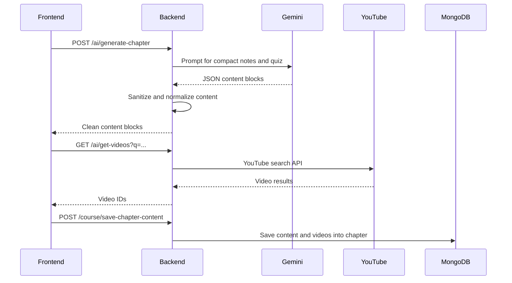

# AI Course Generator - Interview Preparation Guide

## 1. Project Summary

AI Course Generator is a full-stack MERN application that creates personalized study courses from a user-provided topic. A user can sign up, log in, create a course outline using Gemini AI, generate chapter-wise study material, fetch YouTube videos, attempt interactive quizzes, track progress, switch between dark and light themes, and export lesson content as a PDF.

Good interview pitch:

> I built an AI-powered course generator where users enter a topic, difficulty, duration, and number of chapters. The backend uses Gemini to generate a structured course outline and detailed chapter content. The frontend presents the course as an interactive study experience with videos, quizzes, progress tracking, dark mode, and PDF export. I also added authentication, MongoDB persistence, API protection with JWT, deployment readiness, and structured AI response validation.

## 2. High-Level Architecture



Architecture explanation:

- Frontend: React application built with Vite.
- Backend: Express.js API server.
- Database: MongoDB through Mongoose models.
- Authentication: JWT tokens stored in localStorage and sent in the Authorization header.
- AI generation: Gemini API creates course layouts and chapter content.
- Video resources: YouTube Data API fetches videos for each chapter.
- Styling: Tailwind CSS with light and dark mode.
- Deployment: Backend on Render, frontend on Vercel or Netlify.

## 3. Request Flow

### Login Flow



### Course Layout Generation Flow



### Chapter Content Generation Flow



## 4. Backend Architecture

Backend entry point:

- `backend/index.js`
  - Loads environment variables.
  - Connects MongoDB.
  - Creates Express app.
  - Adds JSON/body parsing.
  - Adds CORS.
  - Registers `/auth`, `/ai`, `/course`.
  - Adds `/health` for deployment health checks.
  - Starts server on `PORT`.

### Backend Folder Structure

| File | Purpose |
|---|---|
| `backend/index.js` | Main Express server entry. |
| `backend/Models/db.js` | Connects to MongoDB using `MONGO_CONN`. |
| `backend/Models/User.js` | User schema with name, email, password, role. |
| `backend/Models/CourseModel.js` | Course schema, chapters, content blocks, videos, quizzes. |
| `backend/Routes/AuthRouter.js` | Auth endpoints for signup and login. |
| `backend/Routes/AIRouter.js` | AI endpoints for course layout, chapter content, and videos. |
| `backend/Routes/CourseRouter.js` | Protected course CRUD and chapter content saving. |
| `backend/Controllers/AuthController.js` | Signup/login logic, bcrypt hashing, JWT creation. |
| `backend/Controllers/AiContentFormat.js` | Gemini course layout generation. |
| `backend/Controllers/AiContentController.js` | Gemini chapter content generation and cleanup. |
| `backend/Controllers/Youtube.js` | YouTube Data API search helper. |
| `backend/Middlewares/AuthMiddleware.js` | Verifies JWT token and attaches `req.user`. |
| `backend/Middlewares/AuthValidation.js` | Joi validation for auth inputs. |
| `backend/.env.example` | Environment variable template. |

## 5. Frontend Architecture

Frontend entry point:

- `frontend/src/main.jsx`
  - Renders React.
  - Wraps app with `ThemeProvider`.
  - Wraps routes with `BrowserRouter`.

- `frontend/src/App.jsx`
  - Defines all routes.
  - Public routes: `/`, `/login`, `/signup`.
  - Dashboard route: `/dashboard`.
  - Course creation route: `/create-course`.
  - Course outline route: `/create-course/:courseId`.
  - Study route: `/create-course/:courseId/start`.

### Frontend Folder Structure

| File | Purpose |
|---|---|
| `frontend/src/lib/api.js` | Central fetch helper. Adds base URL, JSON headers, JWT token, and error handling. |
| `frontend/src/_context/ThemeContext.jsx` | Stores theme in localStorage and applies `.dark` class to HTML/body. |
| `frontend/src/_context/UserInputContext.jsx` | Holds temporary course creation form data between steps. |
| `frontend/src/_components/Header.jsx` | Landing page header. |
| `frontend/src/_components/Hero.jsx` | Landing page hero section. |
| `frontend/src/_components/Footer.jsx` | Contact and footer section. |
| `frontend/src/_components/BrandLogo.jsx` | Reusable square logo component. |
| `frontend/src/_components/ThemeToggle.jsx` | Light/dark theme button. |
| `frontend/src/auth/Login.jsx` | Login form, stores token after successful login. |
| `frontend/src/auth/Signup.jsx` | Signup form. |
| `frontend/src/dashboard/Layout.jsx` | Dashboard shell with sidebar/header. |
| `frontend/src/dashboard/_components/AddCourse.jsx` | Dashboard home, saved courses, create button. |
| `frontend/src/create-course/CreateCourse.jsx` | Step-based course builder and course layout generation. |
| `frontend/src/create-course/LayoutCourse.jsx` | Course creation layout wrapper. |
| `frontend/src/create-course/[courseId]/Page.jsx` | Course outline page and Generate Lessons logic. |
| `frontend/src/create-course/_components/LoadingDialog.jsx` | Loading/progress modal during AI generation. |
| `frontend/src/course/[courseId]/start/CourseStart.jsx` | Study interface with chapter sidebar and selected content. |
| `frontend/src/course/[courseId]/start/_components/ChapterContent.jsx` | Notes, videos, quiz interaction, progress, PDF export. |
| `frontend/src/course/[courseId]/start/_components/ChapterListCard.jsx` | Sidebar chapter card with progress. |
| `frontend/src/components/ui/*` | Reusable UI primitives. |

## 6. How API Access Works

Frontend API calls go through `frontend/src/lib/api.js`.

Core idea:

```js
const BASE_URL = import.meta.env.VITE_API_BASE_URL;
const token = localStorage.getItem("token");
```

Then every API request:

- Uses the deployed backend URL from `VITE_API_BASE_URL`.
- Adds `"Content-Type": "application/json"`.
- Adds `Authorization: Bearer <token>` if a token exists.
- Throws a readable error if the backend response is not OK.

Interview answer:

> I centralized API access in an `apiFetch` helper. This avoids repeating base URLs, headers, token logic, and error parsing in every component. The frontend reads `VITE_API_BASE_URL` at build time and attaches the JWT token from localStorage for protected routes.

## 7. Authentication

### Signup

Files:

- `frontend/src/auth/Signup.jsx`
- `backend/Controllers/AuthController.js`
- `backend/Models/User.js`

Flow:

1. User enters name, email, password.
2. Frontend calls `POST /auth/signup`.
3. Backend normalizes email to lowercase.
4. Backend checks if email already exists.
5. Password is hashed using bcrypt.
6. User is saved in MongoDB.
7. Frontend redirects user to login.

### Login

Flow:

1. User enters email and password.
2. Frontend calls `POST /auth/login`.
3. Backend finds user by email.
4. Backend uses `bcrypt.compare`.
5. Backend signs JWT with `JWT_SECRET`.
6. Frontend saves token, name, and email in localStorage.
7. User goes to dashboard.

### Protected Routes

`backend/Middlewares/AuthMiddleware.js` checks:

- Authorization header exists.
- Header starts with `Bearer`.
- Token is valid.
- Token is signed with `JWT_SECRET`.

Then:

```js
req.user = jwt.verify(token, process.env.JWT_SECRET);
```

This lets course routes know which user is making the request.

Important interview point:

> I do not trust frontend email query params for ownership. Course routes use `req.user.email` from the verified JWT and only fetch courses created by that email.

## 8. Course Creation Feature

Main file:

- `frontend/src/create-course/CreateCourse.jsx`

The course builder has 3 steps:

1. Category selection.
2. Topic and description.
3. Options like level, duration, chapters, video preference.

The step state is:

```js
const [activeIndex, setActiveIndex] = useState(0);
```

Temporary form data is stored in:

```js
UserInputContext
```

When user clicks Generate Course Layout:

1. Frontend validates the user is logged in.
2. It creates a strict JSON prompt.
3. It calls `POST /ai/generate-course`.
4. Backend calls Gemini.
5. Frontend formats returned data.
6. Frontend saves it using `POST /course/save`.
7. User is redirected to `/create-course/:courseId`.

## 9. Gemini Course Layout Generation

Main backend file:

- `backend/Controllers/AiContentFormat.js`

Important implementation details:

- Uses `@google/generative-ai`.
- Reads API key from `NODE_GEMINI_API_KEY`.
- Uses `GEMINI_MODEL` or fallback models.
- Uses JSON response MIME type.
- Uses a response schema.
- Validates and normalizes AI output.
- Has fallback model handling.

Why response schema is important:

> AI can return unpredictable text. A schema forces the response into a predictable object with `courseName`, `description`, `category`, `topic`, `level`, duration, and chapters.

Fallback handling:

```js
const MODEL_FALLBACKS = [
  configuredModel,
  "gemini-1.5-flash",
  "gemini-2.0-flash",
].filter(Boolean);
```

Interview answer:

> I made AI generation more stable by requesting JSON, defining a schema, parsing carefully, validating the returned layout, and falling back to another Gemini model if one model fails.

## 10. Chapter Content Generation

Main frontend file:

- `frontend/src/create-course/[courseId]/Page.jsx`

Main backend file:

- `backend/Controllers/AiContentController.js`

Flow:

1. User clicks Generate Lessons.
2. Frontend finds chapters that do not already have content.
3. It generates content in batches of 3 chapters.
4. For each chapter, frontend calls:
   - `POST /ai/generate-chapter`
   - `GET /ai/get-videos`
5. It saves both using:
   - `POST /course/save-chapter-content`

Why batches:

> Generating all chapters one by one is slow. Generating too many at once can hit API limits. I used small batches of 3 as a balance between speed and safety.

## 11. How Quizzes Are Generated

Gemini is prompted to include quiz items:

- 2 quiz questions total.
- Question must be under 140 characters.
- Exactly 4 short options.
- Answer must exactly match one option.
- Explanation must be one short sentence.

Backend schema expects:

```js
quiz: [
  {
    question: String,
    options: [String],
    answer: String,
    explanation: String
  }
]
```

Backend cleanup:

- `normalizeQuiz` checks quiz format.
- Bad quiz items are filtered.
- Long quiz text is clipped.
- Strange AI filler like `_QQ_MARK` is removed.
- Answer is matched to an existing option.

Interview answer:

> The quizzes are generated by Gemini as part of each chapter content block. I do not directly display raw AI output. The backend normalizes the quiz, validates options, clips long text, removes bad filler markers, and ensures the answer matches one of the options.

## 12. How Quiz Interaction Works

Main file:

- `frontend/src/course/[courseId]/start/_components/ChapterContent.jsx`

State:

```js
const [selectedAnswers, setSelectedAnswers] = useState({});
```

Answer key format:

```js
`${sectionIndex}-${questionIndex}`
```

When user clicks an option:

```js
selectAnswer(index, questionIndex, option)
```

Then UI checks:

```js
selected.trim().toLowerCase() === answer.trim().toLowerCase()
```

Visual feedback:

- Correct answer turns green.
- Wrong selected answer turns red.
- Correct answer is revealed.
- Explanation appears after answering.

Interview answer:

> Quiz interaction is handled fully on the frontend. I store the selected option in component state using a section-question key. The UI compares the selected option with the correct answer and conditionally renders colors and feedback.

## 13. How Loading Bar Works

Main files:

- `frontend/src/create-course/[courseId]/Page.jsx`
- `frontend/src/create-course/_components/LoadingDialog.jsx`

State:

```js
const [generationProgress, setGenerationProgress] = useState({
  current: "",
  completed: 0,
  total: 0,
  failed: [],
});
```

Percent calculation:

```js
Math.round((completed / total) * 100)
```

Progress is passed to `LoadingDialog`:

```js
progress={{
  percent: ...,
  label: generationProgress.current
}}
```

LoadingDialog renders:

```js
style={{ width: `${progress.percent}%` }}
```

Interview answer:

> The loading bar is not fake. It is based on actual chapter completion count. Every time a chapter finishes or fails, `completed` increases. The percentage is calculated as completed divided by total pending chapters.

## 14. How Progress Tracking Works

Main files:

- `CourseStart.jsx`
- `ChapterContent.jsx`
- `ChapterListCard.jsx`

Progress is stored in localStorage:

```js
localStorage.setItem(`course-progress-${courseId}`, JSON.stringify(next));
```

Each section uses a key:

```js
`${chapterIndex}-${sectionIndex}`
```

When user clicks Mark as done:

1. `toggleSectionDone` updates state.
2. State is saved in localStorage.
3. Chapter progress bar updates.
4. Sidebar shows done count.

Interview answer:

> I used localStorage for lightweight progress persistence because section completion is user-specific UI state and does not need a database write for this version.

## 15. How YouTube Video Fetching Works

Main files:

- `frontend/src/create-course/[courseId]/Page.jsx`
- `backend/Controllers/Youtube.js`
- `backend/Routes/AIRouter.js`

Frontend builds a query:

```js
`${courseName} ${chapterName} tutorial`
```

Backend calls YouTube Data API:

- `part: "snippet"`
- `type: "video"`
- `videoDuration: "medium"`
- `safeSearch: "strict"`
- `maxResults: 4`

Then backend:

- Removes invalid videos.
- Deduplicates video IDs.
- Returns top 3 IDs.

Frontend embeds videos using:

```js
https://www.youtube.com/embed/${videoId}
```

Interview answer:

> I fetch videos separately from AI content so even if YouTube fails, notes and quizzes can still be saved. I catch YouTube errors and store warnings instead of failing the whole chapter generation.

## 16. How Dark Mode Works

Main files:

- `frontend/src/_context/ThemeContext.jsx`
- `frontend/src/_components/ThemeToggle.jsx`
- `frontend/src/index.css`

Theme is stored:

```js
localStorage.getItem("theme")
```

Theme is applied:

```js
root.classList.toggle("dark", theme === "dark");
body.classList.toggle("dark", theme === "dark");
```

Tailwind dark classes then activate:

```html
dark:bg-slate-950 dark:text-white
```

Interview answer:

> I implemented dark mode with a React context so every page can access the same theme state. The selected theme is persisted in localStorage, and the `.dark` class is applied to the document root and body, which lets Tailwind dark styles work across all routes.

## 17. How PDF Export Works

Main file:

- `frontend/src/course/[courseId]/start/_components/ChapterContent.jsx`

Libraries:

- `html2canvas`
- `jspdf`

Flow:

1. A hidden PDF-safe content area is rendered.
2. User clicks Download PDF.
3. `html2canvas` converts DOM to canvas.
4. Canvas is converted to image.
5. jsPDF creates a PDF.
6. Browser downloads it.

Why hidden safe area:

> The visible UI has dark mode, buttons, animations, and videos. The PDF needs a clean printable format, so I use a separate hidden export layout.

## 18. Data Model Explanation

### User

Stored in `users` collection.

Fields:

- `name`
- `email`
- `password`
- `role`

Password is hashed, not stored as plain text.

### Course

Stored in `courses` collection.

Top-level fields:

- `courseId`
- `name`
- `category`
- `level`
- `includeVideo`
- `createdBy`
- `userName`
- `createdAt`
- `courseOutput`

`courseOutput` contains:

- `courseName`
- `description`
- `category`
- `topic`
- `level`
- `totalDurationSummary`
- `totalDurationSpecific`
- `chapters`

Each chapter contains:

- `chapterName`
- `about`
- `duration`
- `content`
- `videos`

Each content block contains:

- `title`
- `description`
- `codeExample`
- `objectives`
- `keyTopics`
- `readings`
- `quiz`

## 19. Security Decisions

Implemented:

- Password hashing with bcrypt.
- JWT authentication.
- Protected course routes.
- User ownership enforced with `createdBy`.
- API keys stored in environment variables.
- `.env` ignored by Git.
- Input validation for auth.
- AI output sanitization before saving.

Potential improvements:

- Add refresh tokens.
- Store progress in backend.
- Add rate limiting.
- Add CORS origin whitelist for production.
- Add request validation for all course routes.
- Add automated tests.

## 20. Performance Decisions

Implemented:

- Chapter generation runs in batches of 3.
- YouTube timeout reduced.
- Fewer YouTube videos requested.
- Gemini output token limit reduced.
- PDF libraries are lazy-loaded only when downloading PDF.
- Existing generated chapters are skipped.
- Content is saved chapter by chapter.

Interview answer:

> The slowest operation is AI generation. I improved perceived and actual performance by batching chapter generation, reducing token output, limiting YouTube calls, skipping already-generated chapters, and showing progress after each chapter.

## 21. Deployment Architecture

Backend:

- Platform: Render.
- Root directory: `backend`.
- Build command: `npm install`.
- Start command: `npm start`.
- Health check: `/health`.

Frontend:

- Platform: Vercel or Netlify.
- Root directory: `frontend`.
- Build command: `npm run build`.
- Output directory: `dist`.
- API URL: `VITE_API_BASE_URL=https://your-backend-url.onrender.com`.

Important:

Vite environment variables are baked at build time. If `VITE_API_BASE_URL` changes, frontend must be rebuilt/redeployed.

## 22. Environment Variables

Backend:

```env
PORT=8080
MONGO_CONN=your_mongodb_connection
JWT_SECRET=your_secret
NODE_GEMINI_API_KEY=your_gemini_key
NODE_GEMINI_API_KEY_2=your_gemini_key
GEMINI_MODEL=gemini-1.5-flash
NODE_YOUTUBE_API_KEY=your_youtube_key
```

Frontend:

```env
VITE_API_BASE_URL=https://your-backend-url.onrender.com
```

## 23. Feature-by-Feature Interview Explanation

### Feature: Signup/Login

> Signup creates a user after hashing the password with bcrypt. Login verifies the password and returns a JWT token. The frontend stores the token in localStorage and sends it with protected API requests.

### Feature: Create Course Layout

> The user enters topic, category, level, duration, and chapter count. The frontend sends a structured prompt to the backend. The backend asks Gemini for a JSON course layout, validates it, and returns it. Then the frontend saves the course to MongoDB.

### Feature: Generate Lessons

> For each chapter without content, the frontend calls the backend to generate chapter notes and quizzes using Gemini. In parallel it also fetches YouTube videos. Then it saves the content and videos back to the chapter in MongoDB.

### Feature: Interactive Quiz

> Quiz questions come from Gemini but are normalized by the backend. The frontend stores selected answers in state and compares them to the correct answer to show instant feedback.

### Feature: Progress Tracking

> Each section has a Mark as Done button. The frontend stores completed section keys in localStorage using the course ID, then calculates the progress percentage for the chapter and sidebar.

### Feature: Dark Mode

> Dark mode uses a context provider, localStorage, and Tailwind's dark variant. The theme is applied globally to the HTML and body elements so it persists across all pages.

### Feature: PDF Export

> PDF export uses html2canvas and jsPDF. The visible content is converted into a canvas and then saved as a PDF. I lazy-load these libraries to avoid increasing the initial bundle.

## 24. Common Interview Questions And Answers

### Q1. What problem does your project solve?

It reduces the effort needed to create a structured learning plan. A learner can enter any topic and immediately get chapters, study notes, videos, quizzes, and progress tracking in one place.

### Q2. Why did you use MERN?

React gives a dynamic frontend for interactive quizzes and progress tracking. Node and Express provide a lightweight API layer. MongoDB works well because generated course data is nested and flexible.

### Q3. Why MongoDB instead of SQL?

Course data is document-shaped: a course has chapters, each chapter has content blocks, videos, and quizzes. MongoDB lets us store this nested structure naturally.

### Q4. How do you protect user data?

Every course route uses JWT middleware. The backend extracts the logged-in user's email from the token and only fetches or updates courses where `createdBy` matches that email.

### Q5. How do you handle bad AI output?

I use Gemini response schemas, strict prompts, JSON parsing, validation, normalization, and sanitization. The backend trims long text, removes filler markers, validates quiz options, and filters invalid quiz entries.

### Q6. What happens if YouTube fails?

The app still saves AI notes and quizzes. YouTube errors are caught separately and shown as warnings so one external API failure does not break the whole learning flow.

### Q7. How did you improve generation speed?

I generate chapters in batches of 3, reduce Gemini output token size, request compact content, reduce YouTube timeout, fetch fewer videos, and skip already-generated chapters.

### Q8. How does the loading bar work?

It tracks actual chapter progress. The total is the number of pending chapters. Each completed or failed chapter increments the completed count. The bar width is calculated as completed divided by total.

### Q9. How is dark mode persistent?

The theme is saved in localStorage. On app load, ThemeProvider reads it and applies `.dark` to the document root and body.

### Q10. What was the hardest bug?

One hard issue was AI returning strange repeated placeholder text inside quiz questions. I fixed it by adding backend sanitization before sending and saving AI content, and frontend display cleanup for old stored content.

### Q11. What would you improve next?

I would add backend-stored user progress, route-level tests, rate limiting, better admin analytics, regeneration per chapter, and stricter production CORS settings.

### Q12. How would you scale this?

I would move AI generation to a background job queue, use Redis for job status, stream progress to the frontend, cache video results, and store generated content in a separate content collection if courses become very large.

### Q13. Why do you use `apiFetch`?

It centralizes base URL, JSON headers, token attachment, and error handling. This keeps components cleaner and avoids repeated fetch logic.

### Q14. Why use response schemas with Gemini?

Without schemas, AI may return markdown or inconsistent text. A schema makes the output predictable and easier to parse, validate, and save.

### Q15. How do you ensure deployment works?

The backend has a `/health` route. The frontend has SPA rewrite config for Vercel and Netlify. Environment variables are separated for frontend and backend. Production builds are tested with `npm run build`.

## 25. Short 60-Second Interview Pitch

> My project is an AI-powered course generator built with React, Express, MongoDB, and Gemini. A user signs up, enters a topic and learning preferences, and the app generates a complete course outline. Then it generates chapter notes, quizzes, readings, and YouTube videos. The learning page includes interactive quiz feedback, section completion tracking, dark mode, and PDF export. On the backend I used JWT authentication, MongoDB schemas for nested course data, Gemini response schemas, and sanitization to make AI output reliable. I also optimized generation with batching and deployment-ready environment configuration.

## 26. Deep Technical Talking Points

- JWT is stateless, so backend does not need to store sessions.
- bcrypt protects passwords even if database is exposed.
- MongoDB is a good fit for nested course documents.
- AI output is never blindly trusted.
- Frontend state handles UI interactions like selected quiz answers.
- localStorage stores lightweight client preferences like theme and section progress.
- Environment variables keep secrets out of source code.
- Vite requires `VITE_` prefix for frontend env variables.
- The backend and frontend are deployed separately and communicate through HTTP APIs.

## 27. Files To Mention In Interview

If asked "where is this implemented?", mention:

- Auth: `AuthController.js`, `AuthMiddleware.js`, `Login.jsx`, `Signup.jsx`.
- Course layout AI: `AiContentFormat.js`, `CreateCourse.jsx`.
- Chapter generation: `AiContentController.js`, `Page.jsx`.
- Course saving: `CourseRouter.js`, `CourseModel.js`.
- API helper: `api.js`.
- Dark mode: `ThemeContext.jsx`, `ThemeToggle.jsx`.
- Quiz UI: `ChapterContent.jsx`.
- Loading bar: `Page.jsx`, `LoadingDialog.jsx`.
- Progress tracking: `CourseStart.jsx`, `ChapterListCard.jsx`.
- YouTube: `Youtube.js`.
- PDF export: `ChapterContent.jsx`.

## 28. Final Confidence Checklist

Before demo:

- Backend Render service is live.
- Frontend has `VITE_API_BASE_URL` set to backend URL.
- MongoDB Atlas network access allows Render.
- Gemini and YouTube keys are valid.
- Signup works.
- Login works.
- Course layout generation works.
- Lesson generation works.
- Dark mode stays consistent.
- Quiz options are interactive.
- Mark as done updates progress.
- Refreshing nested frontend routes does not show 404.

